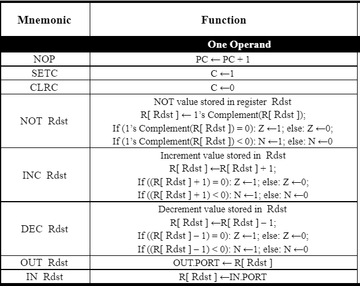
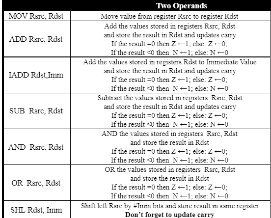
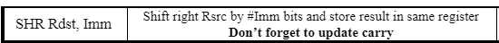
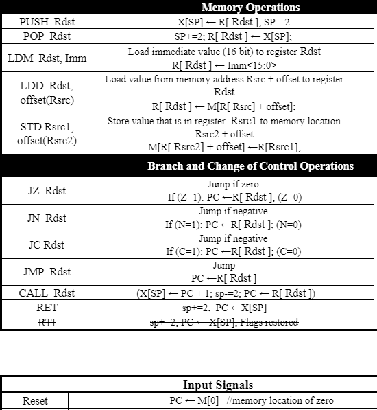
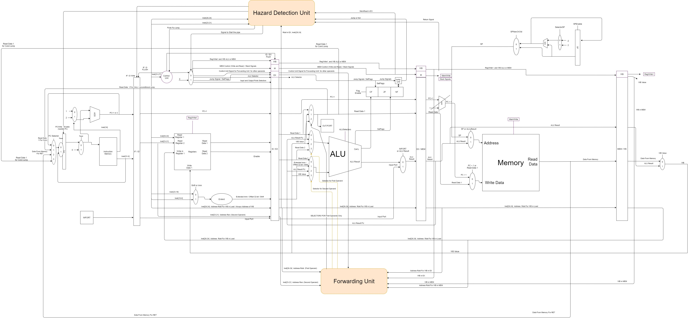

# Computer-Architecture-Processor
## Objective
To design and implement a simple 5-stage pipelined processor, Harvard. 
The design should conform to the ISA specification described in the following sections.

## Introduction
The processor in this project has a RISC-like instruction set architecture. There are eight 4-byte general purpose registers; R0, till R7. Another two general purpose registers, One works as a program counter (PC). And the other, works as a stack pointer (SP); and hence; points to the top of the stack. The initial value of SP is (2^20-2). The memory address space is 1 MB of 16-bit width and is word addressable. ( N.B.  word = 2 bytes). You are allowed to make the data bus 32 bits to access two consecutive words.

## ISA Specifications

### Registers
R[0:7]<31:0> ;  Eight 32-bit general purpose registers\
PC<31:0> ;  32-bit program counter\
SP<31:0> ;  32-bit stack pointer\
CCR<2:0> ;  condition code register\
Z<0>:=CCR<0> ;  zero flag, change after arithmetic, logical, or shift operations\
N<0>:=CCR<1> ;  negative flag, change after arithmetic, logical, or shift operations\
C<0>:=CCR<2> ;  carry flag, change after arithmetic or shift operations.

### Input-Output
IN.PORT<31:0> ;  32-bit data input port\
OUT.PORT<31:0> ;  32-bit data output port\
INTR.IN<0> ;  a single, non-maskable interrupt\

## Design 

